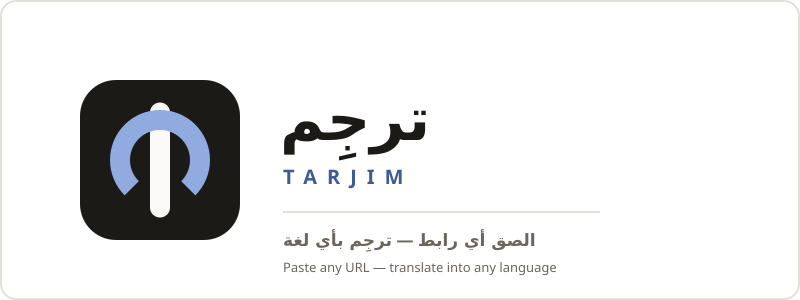

<p align="center">
  <picture>
    <source media="(prefers-color-scheme: dark)" srcset="assets/readme-banner-dark.svg" />
    
  </picture>
</p>

<h1 align="center">ترجِم <span style="color:#888">— Tarjim</span></h1>

<p align="center" dir="rtl">
  <b>الصق أي رابط</b> — فيديو يوتيوب، مقال، موقع، ملف، صورة أو PDF — <b>وارقأه بأي لغة.</b>
</p>

<p align="center">
  &#x200B;
  &#x200B;
  = 22" />&#x200B;
  &#x200B;
  &#x200B;
  
</p>

---

## ✨ الميزات

<table>
<tr>
<td width="50%" valign="top">

### 🎬 يوتيوب + ترجمات
استخراج النص من الفيديو وعرضه **كترجمات مدمجة داخل الصفحة** (IFrame API) — مع تحميل SRT جاهز.

</td>
<td width="50%" valign="top">

### 📰 مقالات ومواقع
جلب من الخادم (يتجاوز CORS) + استخراج النص الرئيسي عبر Readability، وعرض **مقارنة جنباً إلى جنب**.

</td>
</tr>
<tr>
<td width="50%" valign="top">

### 📄 ملفات 11 → 8
SRT مع الحفاظ على التوقيتات، JSON مع الحفاظ على المفاتيح، CSV/XLSX، DOCX والمزيد — استيراد وتصدير.

</td>
<td width="50%" valign="top">

### 🔍 OCR للصور
استخراج النص من الصور عبر Tesseract.js ثم ترجمته — لقطات شاشة، صور ميمز، مستندات مصوّرة.

</td>
</tr>
<tr>
<td width="50%" valign="top">

### 📕 PDF
تحليل من الخادم واستخراج النص ثم ترجمته — تقارير ومستندات كاملة.

</td>
<td width="50%" valign="top">

### 🎤 صوت ودبلجة
تفريغ صوتي عبر Whisper + دبلجة بترتيب جُمل متزامن (gTTS / Edge TTS).

</td>
</tr>
<tr>
<td width="50%" valign="top">

### ⚡ كاش دائم
كاش ترجمة بصلاحية 30 يومًا وشارة ⚡ للنتائج المخزّنة — JSON أو SQLite.

</td>
<td width="50%" valign="top">

### 🌐 إضافة متصفح
Chrome (Manifest V3) — ترجمة أي صفحة بنقرة واحدة داخل المتصفح.

</td>
</tr>
<tr>
<td colspan="2" align="center">

### 🌍 130+ لغة
اكتشاف تلقائي للغة المصدر، وترجمة إلى أكثر من 130 لغة هدف — بدون أي مفاتيح API.

</td>
</tr>
</table>

---

## 🚀 البدء السريع

```bash
git clone https://github.com/MOT1209/-bersetzung-von-alle.git
cd -bersetzung-von-alle
npm install
npm run dev        # http://localhost:3000
```

> **يعمل بلا مفاتيح** — المزوّدات المجانية تعمل فورًا بدون أي إعداد. أضف مفاتيح اختيارية في `.env` لمزوّدات إضافية (Gemini، DeepL، …).

---

## ⚙️ كيف تعمل

```
  الإدخال            الاكتشاف           الترجمة            الإخراج
  ─────────────     ─────────────     ─────────────     ─────────────
  📥 رابط/ملف   →   🔍 كشف تلقائي  →   📖 6 مزوّدات   →   📤 نتيجة + كاش
  (يوتيوب/مقال/     للغة المصدر        مع بدائل تلقائي     قابلة للتصدير
   ملف/صورة)                            عند الفشل
```

- لا تسجيل، ولا تعقيد: الصق رابطًا ← اختر اللغة ← اقرأ.
- النصوص الطويلة تُقسّم تلقائيًا (~4500 حرف للطلب) مع شريط تقدّم حي.
- كتل الكود والروابط والطوابع الزمنية لا تُترجم أبدًا.

---

## 🏗️ البنية التقنية

| الطبقة | التقنية | التفاصيل |
|--------|---------|----------|
| **الواجهة** | ES modules في `public/js/` | عربية RTL، خط Cairo، فاتح/داكن |
| **الخادم** | Node.js + Express | 15 موجّه (router) في `server/routes-*.js` |
| **قاعدة البيانات** | SQLite (`node:sqlite`) | ملف واحد `cache/aralink.db` — بلا بناء أصلي |
| **الترجمة** | 6 مزوّدات موحّدة | Google → MyMemory → Libre → Gemini → DeepL → zen مع بدائل تلقائية |
| **المهام الثقيلة** | `server/jobs/` | STT/دبلجة/OCR بسقف تزامن + تقدّم + إلغاء |
| **التخزين** | محلي أو S3/R2 | بالمفتاح لا بالمسار (`server/providers/storage/`) |
| **الأمان** | Helmet + CORS + Rate-limit | CSP صارم، حد للطلبات لكل IP (ذاكرة أو Redis) |

---

## 🧪 الجودة والاختبار

```bash
npm test                    # 624 اختبارًا (node --test)
npm run lint                # ESLint — 0 تحذيرات
npm run check               # فحص صياغة 105 ملفات
npm run test:coverage       # c8 coverage (نصّي)
npm run test:coverage:html  # تقرير HTML في coverage/
npm run bench:translate     # معيار WER → cache/quality-report.json  ⚠️ يستهلك حصة الترجمة المجانية
npm run perf:translate      # معيار أداء → cache/perf-report.json
```

| المقياس | القيمة | الحدّ الأدنى |
|---------|--------|--------------|
| الاختبارات الناجحة | **624** | — |
| تغطية الأسطر | **~77.9%** | 70% (`.c8rc.json`) |
| تغطية الفروع | **~73.1%** | 60% |
| تغطية الدوال | **~80.6%** | 70% |
| تحذيرات Lint | **0** | `--max-warnings=0` |
| فحص الصياغة | **105 ملفات** | نظيف |

> ⚠️ `bench:translate` يستهلك حصة الترجمة المجانية — شغّله يدويًا فقط، وليس في CI.

---

## 🔑 متغيرات البيئة

| المتغير | الافتراضي | الوصف |
|---------|-----------|-------|
| `PORT` | `3000` | منفذ الخادم |
| `DB_FILE` | `cache/aralink.db` | ملف قاعدة بيانات SQLite |
| `STATS_DRIVER` | `sqlite` | `sqlite` أو `json` |
| `ADMIN_TOKEN` | *(معطّل)* | رمز لوحة الإدارة |
| `SWAGGER_ENABLED` | `false` | تفعيل Swagger UI على `/api/docs` |
| `CACHE_TTL_MS` | `2592000000` | مدة الكاش (30 يومًا؛ `0` = بلا انتهاء) |
| `CORS_ORIGIN` | *(فارغ)* | الأصول المسموحة (فاصلة للفصل؛ فارغ = نفس الأصل فقط) |
| `REDIS_URL` | *(معطّل)* | مشاركة عدّادات الحدود بين خوادم متعددة |
| `JOB_CONCURRENCY` | `2` | أقصى عدد مهام ثقيلة متزامنة |
| `GEMINI_API_KEY` | | مفتاح Gemini (اختياري) |
| `DEEPL_API_KEY` | | مفتاح DeepL المجاني (اختياري) |
| `ZEN_API_KEY` | | مفتاح zen المتوافق مع OpenAI (اختياري) |
| `ZEN_BASE_URL` | `https://opencode.ai/zen/v1` | بوابة zen (Ollama: `localhost:11434/v1`) |
| `YOUTUBE_API_KEY` | | YouTube Data API v3 (بيانات وصفية فقط) |

> القائمة الكاملة مع التعليقات في `.env.example` (161 سطرًا).

---

## 🔒 الأمان

- **Helmet** مع CSP صارم (يسمح فقط بتضمين يوتيوب + Google Fonts + jsdelivr)
- **CORS** من نفس الأصل افتراضيًا (فارغ = لا أصول خارجية مسموحة)
- **Rate-limit** لكل IP — في الذاكرة (مثيل واحد) أو Redis (توسّع أفقي)
- **`trust proxy`** في وضع الإنتاج (خلف Render)
- لا أسرار في المستودع — كل المفاتيح في `.env` (غير مرفوع)

---

## 👩‍💻 للمطوّرين

### هيكل المستودع

```
/
├── public/              ← الواجهة (الوحيدة المخدومة عبر HTTP)
│   ├── index.html       ← الصفحة الرئيسية (RTL)
│   ├── style.css        ← نظام التصميم
│   ├── js/              ← ES modules: app.js, ui.js, translate.js…
│   └── icons/           ← الأيقونات (SVG/PNG، favicons، maskable)
├── server/
│   ├── server.js        ← تطبيق Express
│   ├── translate.js     ← محرك الترجمة + كشف اللغة
│   ├── fetchContent.js  ← استخراج المقالات
│   ├── youtube.js       ← نصوص يوتيوب
│   ├── files.js         ← استيراد/تصدير (11→8 صيغ)
│   ├── routes-*.js      ← مسارات API (15 ملفًا)
│   ├── jobs/            ← محرك المهام الثقيلة
│   ├── db/              ← migrations + queries
│   └── config.js        ← تحميل الإعدادات
├── extension/           ← إضافة كروم (Manifest V3)
├── tests/               ← 60 ملف اختبار
├── agents/              ← نظام الوكلاء المتعدد (12 رئيسي × 2 فرعي)
├── docs/openapi.json    ← OpenAPI 3.1 (~42 نقطة نهاية)
├── assets/              ← لافتة README (فاتح/داكن)
├── specs/               ← مواصفات الميزات
└── scripts/build-icons.js ← مولّد الأيقونات من SVG
```

### التوثيق

| الملف | المحتوى |
|-------|---------|
| `docs/openapi.json` | مواصفة OpenAPI 3.1 لكل النقاط |
| `/api/docs` | Swagger UI (مع `SWAGGER_ENABLED=true`) |
| `AGENTS.md` | إرشادات برمجة الوكلاء |
| `DESIGN.md` | نظام التصميم البصري (ألوان، مكوّنات، طباعة) |
| `TEST_CASES.md` | حالات الاختبار اليدوي |
| `DEPLOY_NOTES.md` | ملاحظات النشر |

### إضافة مزوّد ترجمة جديد

1. أضف المزوّد في `server/translate.js` (سجل المزوّدات)
2. أضف متغير الإعداد في `server/config.js`
3. أضف المفتاح في `.env.example`
4. اكتب اختبارًا في `tests/`

### لوحة الإدارة

`/admin.html` — محمية بـ `ADMIN_TOKEN` (ترويسة `x-admin-token`). تعرض إحصاءات الاستخدام + جودة الترجمة + تكاليف العمليات.

### 🤖 نظام الوكلاء المتعدد

نظام عمل متعدد الوكلاء يغطي كل جوانب المشروع (ترجمة، استخراج، واجهة، خادم، وسائط، أمان، نشر…) — 12 وكيلًا رئيسيًا × 2 فرعي، مع حرس متجوّل (أمان/جودة/مقاييس) وسير عمل جاهز يعمل موجة-بموجة. التفاصيل الكاملة في `SPEC-multi-agent-architecture.md`.

```bash
node agents/index.js list              # هيكل الوكلاء الكامل
node agents/index.js run <workflow>    # تشغيل سير عمل (translate-youtube، security-audit…)
node agents/index.js agent A1.1        # معلومات وكيل محدد
node agents/index.js guardians         # الحرس المتجوّلون
```

---

<p align="center">
  <sub>صُنع بحب للمحتوى العربي ❤️</sub>
</p>
