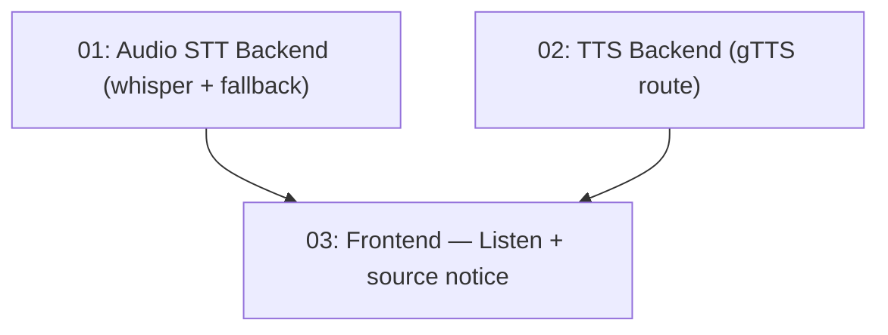

# Audio Pipeline — تفريغ صوتي للفيديوهات بدون ترجمات + قراءة صوتية عربية

## Overview

AraLink relies on YouTube captions. Many videos have none. This feature adds a full audio
pipeline: when a video has no captions, download its audio (yt-dlp + ffmpeg), transcribe it
locally with Whisper (transformers.js, no API key), and feed the resulting timestamped text
into the existing translation flow. It also adds text-to-speech: a "استمع بالعربية" button
plays the translated content as Arabic audio via a free Google TTS endpoint (gTTS).

## Quick Links

- [Requirements](./requirements.md) — full requirements and acceptance criteria
- [Action Required](./action-required.md) — manual steps needing human action

## Dependency Graph

## Waves

| Wave | Tasks | Description |
|------|-------|-------------|
| 1 | task-01, task-02 | Backend: audio download + Whisper STT + no-captions fallback (task-01); gTTS route (task-02). No file overlap. |
| 2 | task-03 | Frontend: listen button, audio playback, "source: audio" notice. Depends on both backend pieces. |

## Task Status

### Wave 1
- [x] [task-01-audio-backend](./tasks/task-01-audio-backend.md) — server/audio.js (yt-dlp → ffmpeg → Whisper), no-transcript fallback in /api/translate
- [x] [task-02-tts-backend](./tasks/task-02-tts-backend.md) — server/tts.js + POST /api/tts (gTTS + ffmpeg concat)

### Wave 2
- [x] [task-03-frontend](./tasks/task-03-frontend.md) — استمع بالعربية button, per-result playback, audio-source notice
