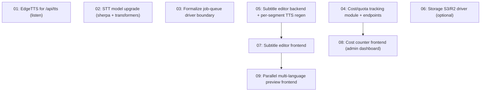

# AraLink Enhancement Suite

## Overview

A coordinated set of seven tooling/feature upgrades for AraLink (the Arabic RTL URL-translation tool). The suite improves audio quality (EdgeTTS for the listen button, bigger Whisper models), adds production durability (object storage driver, formalized job-queue driver boundary), and adds three user-facing features (in-studio subtitle editor, parallel multi-language preview, cost/quota counters in the admin dashboard).

The suite is scoped to **Docker / self-hosted single instance with a persistent disk** (per the deployment decision). This shapes two choices: object storage (S3/R2) is delivered as an *optional driver* beside the existing local disk — not made mandatory — and BullMQ is *not* forced in (it would require Redis as a hard dependency and would break the single-instance memory mode that AraLink relies on). Instead, the existing job queue's driver boundary is made explicit and documented so BullMQ can be layered in later for horizontal scaling without touching routes.

## Quick Links

- [Requirements](./requirements.md) — full requirements, goals, non-goals and acceptance criteria
- [Action Required](./action-required.md) — manual steps needing human action (env vars, API keys)
- Tasks — one self-contained file under `tasks/`

## Dependency Graph

## Waves

| Wave | Tasks | Description |
|------|-------|-------------|
| 1 | task-01, task-02, task-03, task-04 | Independent backend capabilities: EdgeTTS listen, STT model upgrade, queue driver-boundary contract, cost-tracking module. No file overlap (each owns distinct files). |
| 2 | task-05 | Subtitle-editor backend (PATCH segment endpoint + regenerate only that segment's TTS). |
| 3 | task-06, task-07, task-08 | Optional S3/R2 storage driver; subtitle-editor frontend; cost-counter admin frontend. |
| 4 | task-09 | Parallel multi-language preview frontend (builds on the subtitle-editor timeline already added in Wave 3). |

## Task Status

### Wave 1
- [x] [task-01-tts-listen-edge](./tasks/task-01-tts-listen-edge.md) — Use EdgeTTS (with voice) for the `/api/tts` listen endpoint
- [x] [task-02-stt-model-upgrade](./tasks/task-02-stt-model-upgrade.md) — Upgrade both sherpa and transformers Whisper models for better Arabic/Turkish STT
- [x] [task-03-queue-driver-boundary](./tasks/task-03-queue-driver-boundary.md) — Formalize and document the job-queue driver boundary (BullMQ-ready contract, memory default)
- [x] [task-04-cost-tracking](./tasks/task-04-cost-tracking.md) — Track TTS segments, translation chars, and ffmpeg time per job; expose via `/api/stats/cost`

### Wave 2
- [x] [task-05-subtitle-editor-backend](./tasks/task-05-subtitle-editor-backend.md) — PATCH endpoint to edit a segment's translation and regenerate only that segment's TTS

### Wave 3
- [x] [task-06-storage-s3-driver](./tasks/task-06-storage-s3-driver.md) — Add optional S3/R2 storage driver behind the existing key-based storage interface
- [x] [task-07-subtitle-editor-frontend](./tasks/task-07-subtitle-editor-frontend.md) — Editable timeline in the YouTube studio with per-segment re-gen
- [x] [task-08-cost-frontend](./tasks/task-08-cost-frontend.md) — Cost/quota cards in the admin dashboard

### Wave 4
- [x] [task-09-multilang-preview](./tasks/task-09-multilang-preview.md) — Parallel per-language progress grid + per-result players in the studio

## Conventions for Implementers

- UI is **Arabic RTL** (`dir="rtl"`), Cairo/Tajawal font, dark theme. Follow `DESIGN.md`.
- Code comments and agent communication: **English**. Error messages to users: **Arabic**.
- Never write a SQL query outside `server/db/`. Storage goes through `server/providers/storage/` **by key, never by path**.
- Every new router/endpoint must be mounted in `server/server.js` **and** covered by a test that hits its path (see `tests/smoke.test.js`).
- Detect client disconnect with `res.on('close')`, never `req.on('close')`.
- Run `node --check` on changed server files and `npm run lint` after each task.
