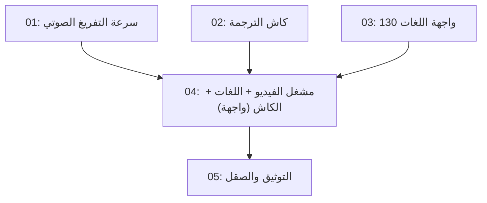

# Speed + Video Player + All Languages

## Overview

المرحلة الثانية من تطوير AraLink بعد ميزة الصوت (audio-pipeline). تهدف إلى: (1) تسريع التفريغ
الصوتي عبر محرك أسرع (sherpa-onnx أو ترقية onnxruntime) وحذف ملف wav الوسيط، (2) كاش ترجمة
دائم يحل مشكلة حصص Google اليومية (429) ويجعل الإعادة فورية، (3) قائمة 130 لغة في زر الاختيار،
(4) مشغل فيديو داخل الصفحة يعرض الترجمة المترجمة متزامنة (خيار أ: يوتيوب مضمّن + شريط متزامن،
خيار ب: فيديو محلي بترجمات WebVTT مرسومة فوقه).

القرارات المعتمدة من المستخدم: الفيديو (أ + ب)، اللغات 130، الكاش نعم.

## Quick Links

- [Requirements](./requirements.md) — المتطلبات ومعايير القبول
- [Action Required](./action-required.md) — خطوات يدوية (تثبيت مكتبة — لا مفاتيح API)

## Dependency Graph

## Waves

| Wave | Tasks | Description |
|------|-------|-------------|
| 1 | task-01, task-02, task-03 | الخلفية: STT أسرع، كاش، لغات (ملفات منفصلة — متوازية) |
| 2 | task-04 | الواجهة: مشغل الفيديو المترجم + زر 130 لغة + شارة الكاش |
| 3 | task-05 | التوثيق والصقل |

## Task Status

### Wave 1
- [x] [task-01-stt-speed](./tasks/task-01-stt-speed.md) — محرك STT أسرع + m4a→f32 مباشر
- [x] [task-02-translation-cache](./tasks/task-02-translation-cache.md) — كاش ترجمة ملفي + meta.cached
- [x] [task-03-languages-api](./tasks/task-03-languages-api.md) — GET /api/languages من server/languages.js

### Wave 2
- [x] [task-04-video-player-frontend](./tasks/task-04-video-player-frontend.md) — مشغل فيديو + لغات + شارة الكاش

### Wave 3
- [ ] [task-05-docs-polish](./tasks/task-05-docs-polish.md) — توثيق README وصقل نهائي
