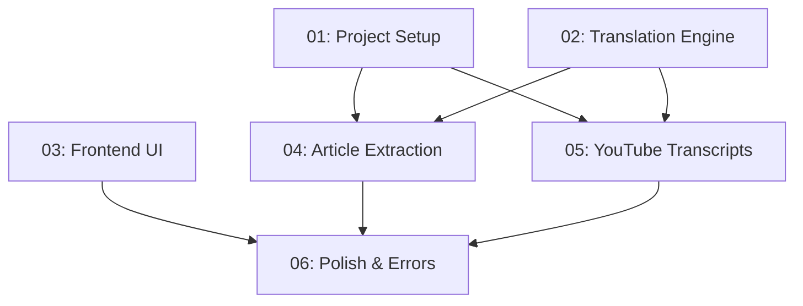

# AraLink — URL Translation Tool

## Overview

AraLink translates anything from a URL (YouTube videos, articles, websites) into any
language, with an Arabic RTL interface. Six tasks build the full product: server
skeleton, translation engine, RTL UI, article extraction, YouTube transcripts, and a
final polish pass. All tasks are fully self-contained; each file in `tasks/` carries its
own context so a coder agent can pick any task up cold.

## Quick Links

- [Requirements](./requirements.md) — full requirements and acceptance criteria
- [Action Required](./action-required.md) — manual steps needing human action

## Dependency Graph

## Waves

| Wave | Tasks | Description |
|------|-------|-------------|
| 1 | task-01, task-02, task-03 | Foundation: server skeleton + static serving, translation engine, RTL frontend UI. Independent — run in parallel. |
| 2 | task-04, task-05 | Content pipelines: article/website extraction + YouTube transcript translation. Both depend only on Wave 1. |
| 3 | task-06 | Polish: error contract, edge cases, full acceptance verification. |

## Task Status

### Wave 1
- [x] [task-01-project-setup](./tasks/task-01-project-setup.md) — Server skeleton, static serving, design tokens, shell UI
- [x] [task-02-translation-engine](./tasks/task-02-translation-engine.md) — Detect/chunk/translate with Gemini fallback
- [x] [task-03-frontend-ui](./tasks/task-03-frontend-ui.md) — Arabic RTL interface, tabs, progress, errors

### Wave 2
- [x] [task-04-article-extraction](./tasks/task-04-article-extraction.md) — Article/website fetching + /api/translate route
- [x] [task-05-youtube-transcript](./tasks/task-05-youtube-transcript.md) — YouTube captions extraction + translation

### Wave 3
- [x] [task-06-polish-errors](./tasks/task-06-polish-errors.md) — Error contract, edge cases, final verification
