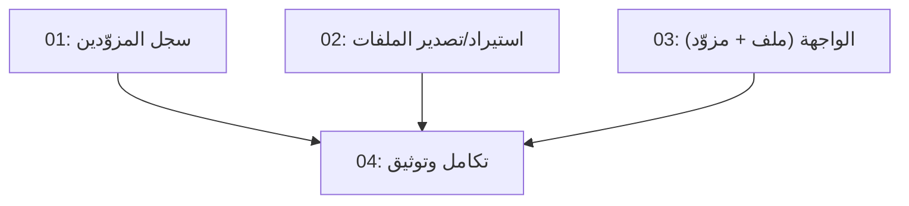

# Wave 1 — Providers + Files (المزودون الموحدون + ملفات)

## Overview

الموجة الأولى من خطة «المنصة العالمية المجانية» لأرا لينك. هدفها تحويل AraLink من أداة
روابط إلى منصة ترجمة حقيقية: (1) **طبقة مزودين موحّدة** — كل محرك ترجمة يصبح «مزوّداً»
مسجلاً بواجهة مشتركة (Google/MyMemory/Libre/Gemini + DeepL المجاني + أي مزوّد متوافق
مع OpenAI مثل Ollama وLM Studio المحليين مجاناً)، مع تبديل فوري من الواجهة، و(2)
**استيراد/تصدير ملفات** — DOCX/XLSX/PPTX/EPUB/SRT/VTT/CSV/JSON/XML/TXT/MD يُترجم
محتواها ويُصدَّر بنفس البنية. كل شيء **مجاني** (لا مفاتيح مدفوعة مطلوبة؛ المزوّدات
التي تتطلب مفتاحاً مجانياً أو محلياً تُفعَّل اختيارياً فقط).

ملاحظة تشغيل: جلسة موازية أخرى تعمل في نفس المستودع (إضافة متصفح + PWA + ترجمة
ذكية). لا نلمس `extension/` ولا `public/sw.js` ولا `public/manifest.webmanifest` ولا
`public/icons/`. قبل تعديل أي ملف: أعد قراءته من القرص (قد تغيّر الجلسة الموازية).

## الخارطة الكلية (رؤية المنصة العالمية — كلها مجانية)

| الموجة | المحتوى | الحالة |
|--------|---------|--------|
| 1 | طبقة المزوّدين الموحّدة + ملفات (Word/Excel/PPT/EPUB/SRT/JSON/XML/CSV) | ⏳ هذه المواصفة |
| 2 | OCR مجاني (tesseract.js) للصور/لقطات/PDF الممسوح + فيديو محلي (STT→ترجمة→ترجمات) + تشكيل عربي | ⬜ لاحقاً |
| 3 | إضافة متصفح + PWA أوفلاين + API عام | ⬜ جلسة موازية تعمل على الإضافة/PWA |
| 4 | سطح مكتب (Tauri) / جوال (Capacitor) / محادثة صوتية / أوفلاين كامل (NLLB-200) | ⬜ لاحقاً |

## Quick Links

- [Requirements](./requirements.md) — المتطلبات ومعايير القبول
- [Action Required](./action-required.md) — خطوات يدوية (لا يوجد — كل شيء مجاني)

## Dependency Graph

## Waves

| Wave | Tasks | Description |
|------|-------|-------------|
| 1 | task-01, task-02, task-03 | متوازية (لا تداخل في الملفات): سجل المزوّدين، ملفات، واجهة |
| 2 | task-04 | تكامل نهائي: اختبارات كاملة + توثيق + فحص يدوي |

## Task Status

### Wave 1
- [x] [task-01-provider-registry](./tasks/task-01-provider-registry.md) — سجل مزوّدين موحّد + DeepL/OpenAI-compatible + /api/providers
- [x] [task-02-file-import-export](./tasks/task-02-file-import-export.md) — استيراد/تصدير 11 صيغة ملف + /api/translate-file + /api/export
- [x] [task-03-frontend-files-providers](./tasks/task-03-frontend-files-providers.md) — واجهة: وضع ملف + أزرار تصدير + اختيار المزوّد

### Wave 2
- [ ] [task-04-integration-docs](./tasks/task-04-integration-docs.md) — npm test كامل + إصلاح + README/CHANGELOG + فحص يدوي
