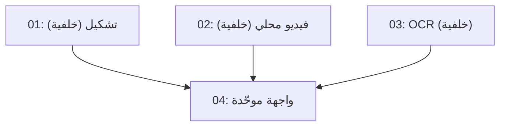

# Wave 2 — Local Video + Tashkeel + OCR

## Overview

الموجة الثانية لأرا لينك: (1) **فيديو محلي** — رفع ملف فيديو → تفريغ صوتي محلي (sherpa-onnx الموجود) → ترجمة → ترجمات WebVTT فوق الفيديو، (2) **تشكيل عربي** — زر يضيف الحركات للنص المترجم (Gemini المجاني + احتياطي قواعدي بلا شبكة)، (3) **OCR** — استخراج نص من الصور عبر tesseract.js (يتطلب npm install — يُثبَّت في الخلفية أولاً). كل شيء مجاني.

## Dependency Graph

## Waves

| Wave | Tasks | Description |
|------|-------|-------------|
| 1 | task-01, task-02, task-03 | خلفية متوازية — كل وكيل يكتب ملفاته فقط؛ **لا أحد يلمس server.js ولا public/** (المنسّق يركّب الرواتر) |
| 2 | task-04 | واجهة موحّدة بوكيل واحد (لا تعارض كتابة) |

## Task Status

### Wave 1 (backend)
- [x] task-01-tashkeel — server/tashkeel.js + server/routes-tashkeel.js + tests/tashkeel.test.js
- [x] task-02-local-video — refactor server/audio.js + server/routes-local-video.js + translateLines في routes-translate.js + config.js/.env.example + tests/localvideo.test.js
- [x] task-03-ocr — server/ocr.js + server/routes-ocr.js + سكربت تحميل traineddata + tests/ocr.test.js

### Wave 2 (frontend)
- [x] task-04-frontend — public/index.html + script.js + style.css (فيديو/تشكيل/OCR)

## قواعد مشتركة
- لا تنفّذ git add/commit/clean/checkout — أبداً. لا تلمس extension/ ولا public/sw.js ولا manifest ولا icons/.
- جلسة موازية نشطة في المستودع — أعد قراءة أي ملف من القرص قبل تعديله.
- التعليقات بالعربية، CommonJS، Node 18+. الاختبارات بلا شبكة حقيقية (stub/حقن).
- لا تقم بـ npm install — إلا task-03 (tesseract.js يُثبَّت في الخلفية بواسطة المنسّق؛ تحقق أنه موجود قبل البدء).
