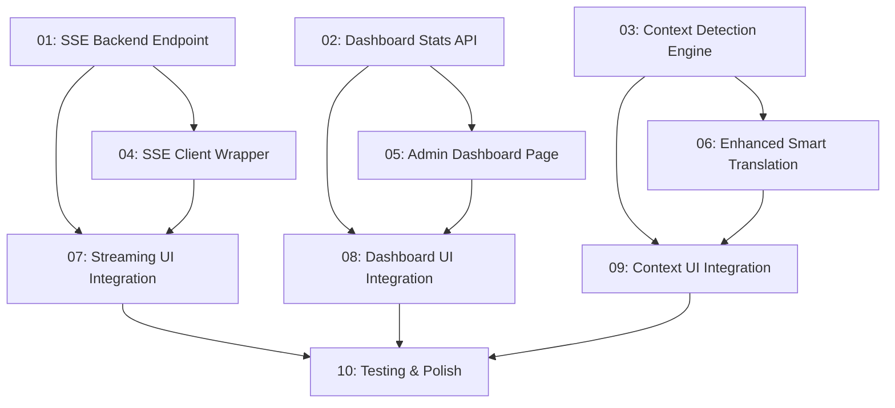

# Wave 3 — ميزات جديدة (1-2 شهر)

## Overview

ثلاث ميزات جديدةرئيسية تحول AraLink من أداة ترجمة بسيطة إلى منصة ترجمة احترافية:

1. **ترجمة بث مباشر (SSE)** — عرض الترجمة وهي تصل سطرًا بسطر عبر Server-Sent Events بدل الانتظار حتى الاكتمال
2. **لوحة تحكم استخدامات** — صفحة admin dashboard مع مخططات وإحصائيات(time-series, providers, languages)
3. **ترجمة ذكية مع سياق** — تحسين `translate-smart` بإضافة سياق الصفحة ونوع المحتوى تلقائيًا

## Quick Links

- [Requirements](./requirements.md) — المتطلبات الكاملة ومعايير القبول
- [Action Required](./action-required.md) — خطوات يدوية تحتاج إجراء بشري

## Dependency Graph

## Waves

| Wave | Tasks | Description |
|------|-------|-------------|
| 1 | t01, t02, t03 | Backend infrastructure: SSE endpoint, stats API, context detection — كلها مستقلة بالكامل |
| 2 | t04, t05, t06 | Client-side modules: EventSource wrapper, admin dashboard page, enhanced smart translation |
| 3 | t07, t08, t09 | UI integration: streaming UI, dashboard navigation, context UI — تدمج كل الميزات في الواجهة |
| 4 | t10 | Testing, polish, performance verification |

## Task Status

### Wave 1
- [ ] [task-01-sse-backend](./tasks/task-01-sse-backend.md) — SSE streaming endpoint
- [ ] [task-02-dashboard-stats-api](./tasks/task-02-dashboard-stats-api.md) — Dashboard stats API
- [ ] [task-03-context-detection](./tasks/task-03-context-detection.md) — Context detection engine

### Wave 2
- [ ] [task-04-sse-client](./tasks/task-04-sse-client.md) — EventSource client wrapper
- [ ] [task-05-admin-dashboard](./tasks/task-05-admin-dashboard.md) — Admin dashboard page
- [ ] [task-06-enhanced-smart](./tasks/task-06-enhanced-smart.md) — Enhanced smart translation

### Wave 3
- [ ] [task-07-streaming-ui](./tasks/task-07-streaming-ui.md) — Streaming UI integration
- [ ] [task-08-dashboard-ui](./tasks/task-08-dashboard-ui.md) — Dashboard UI integration
- [ ] [task-09-context-ui](./tasks/task-09-context-ui.md) — Context UI integration

### Wave 4
- [ ] [task-10-testing-polish](./tasks/task-10-testing-polish.md) — Testing & polish
